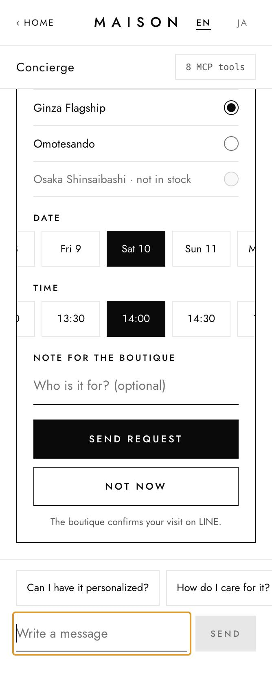
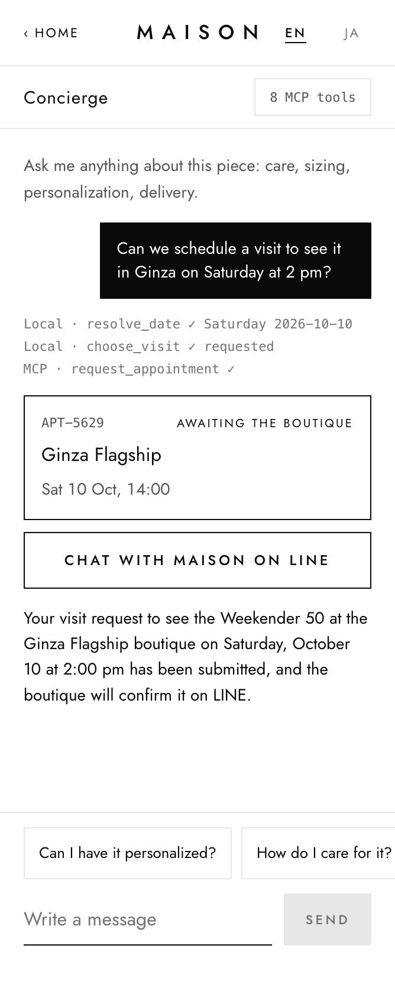
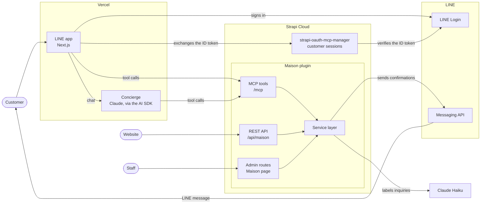

# Maison: from UX to AX with Strapi MCP

A demo for a fictional luxury house: a LINE app, an AI concierge and staff in the Strapi admin all work through one Strapi plugin and Strapi's built-in MCP server.

---

## Highlights

- **One service layer in Strapi.** The Maison plugin's MCP tools, REST API and admin routes call the same services, so the catalog, opening hours and booking rules are in one place.
- **A LINE app built on MCP.** The Next.js app reads the catalog and books visits with MCP tool calls, and its **Agent view** shows the call each screen makes.
- **A concierge that prepares the visit.** Claude, through the AI SDK, finds pieces with the same tools and fills in the **Book a visit** form in the chat. The customer books with one tap on **Send request**.
- **Staff confirm in the Strapi admin.** The Maison page lists visit requests, questions the concierge handed to staff, and every concierge turn, labelled by Claude Haiku.
- **The confirmation on LINE.** When staff confirm a visit, Strapi sends the customer a LINE message through the [Messaging API](https://developers.line.biz/en/docs/messaging-api/overview/).
- **Runs on one laptop.** Local mode simulates LINE sign-in and can run the concierge on a local model. The same app also runs inside LINE.

<p align="center">
  
  &nbsp;&nbsp;
  
</p>
<p align="center"><sub>Left: the concierge's visit picker, filled in. Right: after <b>Send request</b>, the visit's card and the concierge's reply.</sub></p>

---

## Overview

Maison is a fictional luxury house of trunks, bags and small gifts. Its customers browse the catalog in an app built for LINE (a [LIFF](https://developers.line.biz/en/docs/liff/overview/) app), ask a concierge for a gift, and request a boutique visit. Staff confirm the request in the Strapi admin, and Strapi sends the customer's confirmation on LINE.

In the title, UX is the screens a customer taps, and AX is an agent that acts for the signed-in customer through the same tools. Everything goes through the Maison plugin: [MCP](https://modelcontextprotocol.io) tools on [Strapi's MCP server](https://docs.strapi.io/cms/features/strapi-mcp-server) for the app, the concierge and staff agents, a REST API for websites, and admin routes for the Maison page. In local mode, LINE sign-in is simulated with LINE's official LIFF mock and a local stand-in for LINE's ID token verify endpoint. Everything else runs as it does in production.

The demo was built for "Building the AI-Powered Connected Experience" (QBurst and LY Corporation, Tokyo, 7 October 2026). It follows LINE's MINI App design guidelines, so it can also run as a [LINE MINI App](docs/line-mini-app.md).

---

## Architecture



In local mode, Strapi, the app and a LINE verify mock run on one laptop, and the concierge uses a local model unless `liff/.env` has a Claude key.

---

## Quick start

You need Node.js 22.12 or later and npm, and a model for the concierge (see [Requirements](#requirements)).

```bash
git clone https://github.com/PaulBratslavsky/maison-demo.git
cd maison-demo
npm install   # installs strapi/ and liff/, builds the Maison plugin, creates both .env files with new secrets
npm run dev   # Strapi on :1338, the app on :3003 and the LINE verify mock on :4545, all on 127.0.0.1
```

The first start builds Strapi's admin, which takes a minute. Then, in a second terminal:

```bash
npm run setup   # the demo admin, the catalog and its public REST reads, the tokens and the app's OAuth client
```

Stop `npm run dev` (Ctrl-C) and start it again, so the app reads its OAuth client. Then open:

- **The app:** http://localhost:3003. It signs in a demo customer with the LIFF mock, and starts in English: **EN**/**JA** in the header switches the language. Open it as `localhost`: Strapi's CORS allows the app at `http://localhost:3003`, not at `http://127.0.0.1:3003`.
- **The Strapi admin:** http://localhost:1338/admin, then **Maison** for the requests board. Sign in with `DEMO_ADMIN_EMAIL` and `DEMO_ADMIN_PASSWORD`: open `strapi/.env` in your editor to read them. `npm install` generated the password for your copy, and nothing prints it.

To try the whole flow, open **Ask the concierge** in the app and tap the first suggestion. The concierge suggests a gift and shows the **Book a visit** form, filled in. Tap **Send request**, then press **Confirm** on the Maison board.

---

## Requirements

- **Node.js 22.12 or later,** and npm.
- **A model for the concierge.** Keys go in `liff/.env`. Restart the app after changing it.

  | Key in `liff/.env` | Model |
  |---|---|
  | none (the default) | `qwen3-14b-32k` on [Ollama](https://ollama.com) at `http://localhost:11434/v1` (`OLLAMA_MODEL`, `OLLAMA_BASE_URL`) |
  | `ANTHROPIC_API_KEY` | Claude Sonnet 5 |
  | `AI_GATEWAY_API_KEY` | Claude Sonnet 5, through [Vercel AI Gateway](https://vercel.com/docs/ai-gateway) |

- **For the local model:** Qwen3 14B with a 32k context. It takes about 20 to 60 seconds a turn, where Claude takes seconds. Any Ollama model that calls tools works through `OLLAMA_MODEL`. Create it from a `Modelfile`:

  ```text
  FROM qwen3:14b
  PARAMETER num_ctx 32768
  ```

  ```bash
  ollama pull qwen3:14b
  ollama create qwen3-14b-32k -f Modelfile
  ```

- **Optional, for labelling inquiries:** an Anthropic key in `strapi/.env` as `AI_API_KEY` (see [Inquiry labelling](docs/architecture.md#inquiry-labelling)).

---

## Local development

- **The ports are the demo's own,** so it runs next to a Strapi on 1337. `npm run dev:strapi` and `npm run dev:app` start the two halves separately.
- **Everything listens on this machine only.** To use the app from a phone, see [option B](docs/line-setup.md#option-b-the-real-app-inside-line).

### Running `npm run setup` again

`npm run setup` is safe to run again. Each run:
- **replaces the "Maison app" OAuth client,** so `liff/.env` gets a new client ID. Restart the app, and reload its page: until then, the concierge answers 502 for a customer session the server has dropped.
- **mints new "Maison customer" and "Maison ops" tokens,** and rewrites `strapi/.tmp/maison-ops-token`. If you connected an agent to the ops tools, give it the new token (see [Ops tools for an agent](#ops-tools-for-an-agent)).
- **first prints the Strapi address it sets up.** Shell variables (`PORT`, `STRAPI_URL`, `DEMO_ADMIN_EMAIL`, `DEMO_ADMIN_PASSWORD`) take priority over `strapi/.env`, so unset them if that address looks wrong.

### Start over with a clean database

1. Stop Strapi. Delete the database and the uploaded images together, keeping `.gitkeep`:

   ```bash
   rm -f strapi/.tmp/data.db
   find strapi/public/uploads -type f ! -name .gitkeep -delete
   ```

   The catalog's images are in `strapi/public/uploads/`, and Maison's integration tests leave about 57 MB there per run. Delete uploads only together with the database, never by hand while the demo's data is loaded.
2. Start Strapi, run `npm run setup`, and restart the app and reload its page.

---

## How it works

The Maison plugin's services hold the rules: the catalog, opening hours, who may book what, and who sees a customer's LINE user ID. Three interfaces call them:

| Interface | Used by | Where |
|---|---|---|
| MCP tools | The Maison app, its concierge, and staff agents | `/mcp`, with a customer's session or an admin token |
| REST API | Websites | `/api/maison/…` |
| Admin routes | The Maison page and the Homepage widgets in the Strapi admin | `/maison/…` on Strapi's admin API |

- **Customer sessions.** The app signs the customer in with LINE, and [strapi-oauth-mcp-manager](https://www.npmjs.com/package/strapi-oauth-mcp-manager) exchanges the LINE ID token for a short-lived Strapi session. The MCP tools and the REST API's customer routes take that session.
- **The concierge** runs on the app's server with the [AI SDK](https://ai-sdk.dev), as the signed-in customer. It answers from the catalog tools and Maison's product knowledge, and hands questions it can't answer to staff.
- **The visit picker.** When a customer asks to visit, the concierge calls `choose_visit`, and the chat shows the **Book a visit** form, filled in with the boutique, day and time the customer named. The tap on **Send request** books the visit with `request_appointment` over MCP, the same call as the product page's form, and the concierge says the visit is requested. The model itself never books.
- **Staff** work on the Maison page in the Strapi admin: the requests board, the **Questions** tab, and the **Inquiries** tab, where a model labels every concierge turn.
- **LINE confirmations.** Whichever way staff confirm a visit, Strapi sends the customer's confirmation itself, through the Messaging API.

> More in [How Maison works](docs/architecture.md): the REST API with `curl` examples, the MCP tools, and the concierge's rules.

### Ops tools for an agent

Strapi sends the LINE confirmations itself, so the demo needs no agent for them. Maison also has two ops tools, `pending_confirmations` and `record_confirmation`, and the prompt `send_pending_confirmations`, for an agent that retries the confirmations that weren't sent. `npm run setup` mints their token, "Maison ops", in `strapi/.tmp/maison-ops-token`. To connect Claude Desktop, see [Ops tools for an agent](docs/ops-tools.md).

---

## Testing

```bash
npm test                              # unit tests, with nothing running
npm run test:e2e                      # browser and API tests, with Strapi running in local mode
npm run test:live                     # the concierge against the running Strapi, on the local model
LIVE_MODEL=claude npm run test:live   # the visit picker's cases on Claude, with the key in liff/.env
```

`test:e2e` and `test:live` change the demo database. [Testing](docs/testing.md) says what each command runs and what it leaves behind.

---

## Deployment

- **The app** (`liff/`) deploys to [Vercel](https://vercel.com) as a Next.js project. Its settings are the Vercel project's environment variables, listed in [Production settings](docs/production.md#production-settings).
- **Strapi** (`strapi/`) deploys to [Strapi Cloud](https://strapi.io/cloud). Never run `npm run setup` against it: the steps there are done by hand.

> The production settings for Vercel and Strapi Cloud, the [first-time setup on Strapi Cloud](docs/production.md#first-time-setup-on-strapi-cloud) and the production notes are in [Deploying and running in production](docs/production.md).

---

## Documentation

| Page | What it covers |
|---|---|
| [How Maison works](docs/architecture.md) | The repository layout, the service layer, customer sessions, the MCP tools, the REST API, the concierge and its visit picker, and inquiry labelling |
| [Running with real LINE](docs/line-setup.md) | Option A: a real LINE message on your phone. Option B: the real app inside LINE |
| [Running Maison as a LINE MINI App](docs/line-mini-app.md) | The integration slide, what's ready for QBurst, and running the app on a LINE MINI App channel |
| [Ops tools for an agent](docs/ops-tools.md) | The ops tools, and how to connect Claude Desktop |
| [Testing](docs/testing.md) | Unit, browser, API and live tests, and Maison's own suites |
| [Deploying and running in production](docs/production.md) | The production settings, the first-time setup on Strapi Cloud, and production notes |
| [The Maison plugin in this repo](docs/maison-plugin.md) | Where the plugin lives, how it shares Strapi's packages, and how to work on it |
| [Running the talk demo](docs/talk-demo.md) | The talk's setup, checklist, 3-minute run, rehearsal and backup video |
| [The Maison plugin's README](strapi/src/plugins/maison/README.md) | The plugin's full reference: tools, routes, permissions and admin pages |
